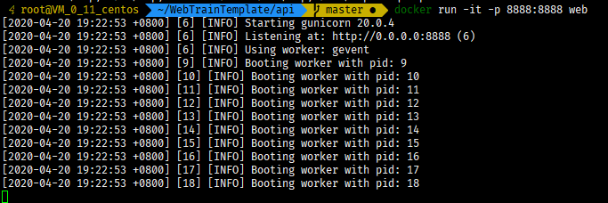

## 前置知识

### Linux环境

#### 必要性

首先关于这个问题, 因为我们的项目最终都是部署于docker容器中的, 所以其实Linux与Windows区别不是特别的明显.

但其实个人还是推荐使用Linux, 因为无论是docker的支持还是资源占用方面, Linux都更胜一筹,  所以个人在这里还是推荐大家尽量使用Linux环境.

#### 关于服务器

这个问题, 只能说尽量的能做到有一台自己的服务器, 如果你不想污染自己本机的环境, 你可以使用虚拟机/[docker for windows](https://docs.docker.com/docker-for-windows/install/), 但其实我也没尝试过这两样, 所以如果在Windows下出现问题请讲解结束后再私聊我解决.

#### 服务器推荐

如果你真的想着有一台服务器的话, 你大可尝试各云服务厂商的学生机, 用来部署一些简单的服务是很可行的.

这里稍微列举几家:

[现在貌似还可以白嫖的阿里云](https://developer.aliyun.com/adc/student/?accounttraceid=1f408a7bfd0b44d0b0b0ac3d1d720f50wsns#ecscolleges-class)

[阿里云学生计划(买轻量服务器就够用了)](https://promotion.aliyun.com/ntms/act/campus2018.html)

[腾讯云](https://cloud.tencent.com/act/campus)

[华为云(之前崩过一次 不推荐)](https://developer.huaweicloud.com/campus?productType=KC1_1&timeType=1&regionType=1&domainItemData=)

#### 系统与初始化设置

系统方面选取比较出名的Linux发行版就可以了(个人是一直在用centos), 

连接方面, 个人使用的是xshell连接, 如果有别的ssh terminal用也可以,

[如何连接可以看这篇文章: 🔗链接](https://www.xshellcn.com/xsh_column/lianjie-linux.html)

基本的Linux命令:

[Linux 文件与目录管理](https://www.runoob.com/linux/linux-file-content-manage.html)

连接上之后便可以自己进行相关设定(下面的这两项可以不做):

- 改ssh端口
- 修改安全组规则

### docker

#### docker是什么

docker容器与宿主之间的关系就如其名一样, 是类似寄生的关系, 容器无法脱离宿主独自运行, 它依赖于宿主系统的内核, 仅是让自己容器与宿主系统的文件系统, 网络, 进程等系统进行隔离, 独自运行.

可以大概的说docker是简单高效的虚拟机, 它牺牲了独立性换来了高效与快速.

具体介绍的可以看如下几篇:

[什么是 Docker](https://yeasy.gitbooks.io/docker_practice/introduction/what.html)

[为什么要使用 Docker？](https://yeasy.gitbooks.io/docker_practice/introduction/why.html)

[Docker 核心技术与实现原理](https://draveness.me/docker/)

#### docker的安装

- Windows
    - [官方教程](https://docs.docker.com/docker-for-windows/install/)
    - [菜鸟教程](https://www.runoob.com/docker/windows-docker-install.html)

- Linux
    - [官方教程](https://docs.docker.com/engine/install/)
    - [民间入门教程](https://yeasy.gitbooks.io/docker_practice/install/)

#### docker-compose安装

[🔗教程连接](https://yeasy.gitbooks.io/docker_practice/compose/install.html)

```shell
$ sudo curl -L https://github.com/docker/compose/releases/download/1.24.1/docker-compose-`uname -s`-`uname -m` > /usr/local/bin/docker-compose
$ sudo chmod +x /usr/local/bin/docker-compose
```

### 安装完成后(本项可以不做)

可以稍微测试着跑一下示例程序:

```shell
git clone https://github.com/xmmmmmovo/WebTrainTemplate.git
cd WebTrainTemplate
cd api
docker build -t "web" .
docker run -it -p 8888:8888 web
```

这时候如果显示如下



并且访问`http://host:8888/`

出现


则说明安装没有错误

### MySQL

#### MySQL是什么

一个高性能的关系型数据库

#### MySQL怎么用

作为一个数据库, 其系统对外提供了很多诸如增删改查的api, 需要驱动进行外部调用.

当然 为了统一各类语言之间的差异, MySQL中的各类操作的实现均使用`SQL`这一`DSL`进行的, 

在这里有一篇21min入门MySQL的文章, 至少本次讲解是不会超出这个文章的范畴的

[连接🔗](https://www.cnblogs.com/mr-wid/archive/2013/05/09/3068229.html)

所以便衍生出了图形化数据库管理及发展软件, 其中比较著名的便是[navicat](https://defcon.cn/513.html)

还有便是[datagrip(这个是已经被集成在jb家各个ide中了已经)](https://www.jetbrains.com/datagrip/)

#### 没接触过怎么办

这里在下搭了一个简单的mysql环境供大家测试使用

host:119.3.166.63

port:3306

user:root

password:123456

admin界面:http://119.3.166.63:8080/

这个后天下午就会删了 这两天随便玩弄


